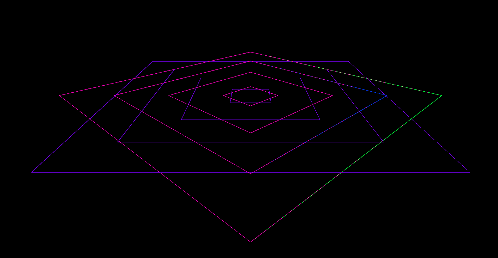
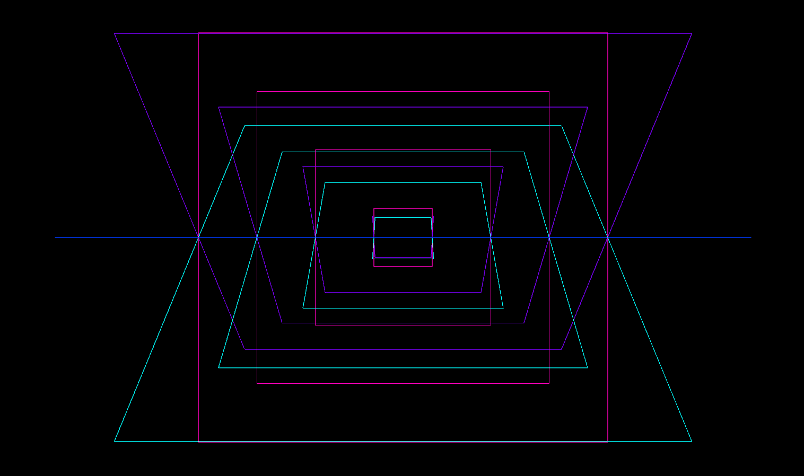
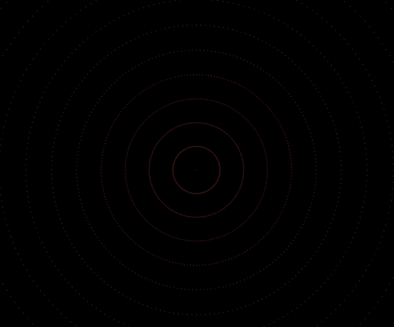
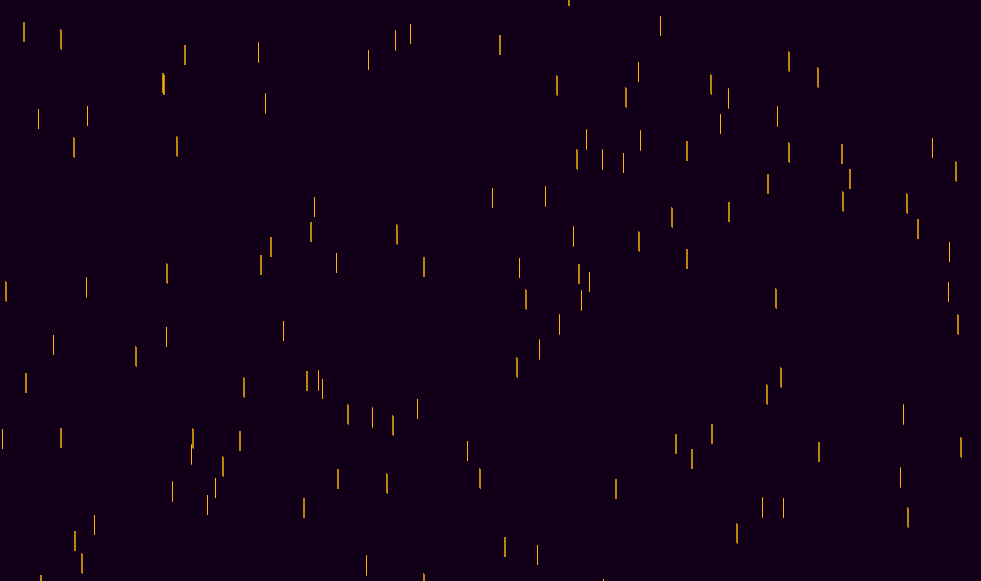
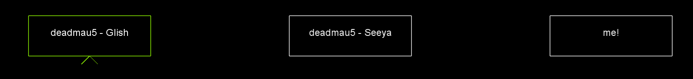

# Music Visualiser Project

Name: Andrew Kennan

Student Number: C19429514

# Description of the assignment
This assignment is a visual and auditory experience that the user can freely interact with and explore at thier own pace. The visuals react directly with the music, and change their size, colour, and speed depending on the amplitude of certain frequencies. The main visual is a colection of intersecting rectangles of various colours. The colours corrospond to the frequency they react to, and the size of the rectangles increases the closer to the center they are. These rectangles are also arranged in 4 distinct "orbits" that revolve around the center in alternating directions. There are an array of dots in a circular pattern in the background that change brightness and colour depending on the amplitude of the frequencies. Lastly, there are particles that fall randomly from the top of the screen, that increase brightness and opacity depending on the amplitude of the frequencies.

# Instructions
- Spacebar - play/pause music.
- x - rotate rectangles in x-axis (must hold down key).
- s - change rotation of rectangles and reverse particle direction (must hold down key).

When the music is paused/not playing, click on a button to change the song. The song by default is "Glish", however you can also choose between "Seeya" and a demo of one of my very own songs.

# How it works
### Rectangles
The rectangle visuals are all controlled within this for-loop:
```Java
for(int i = 0 ; i < bands.length ; i ++)
```
The rectangles are drawn like so:
```Java
// Outer rectangles
rotateY(rotright);
box(700, h*2, 700);

// Second from out
rotateY(rotleft*2);
box(500, h*3, 500);

// Second from in
rotateY(rotright*2);
box(300, h*4, 300);

// Inner rectangles
rotateY(rotleft*2);
box(100, h*5, 100);
```

First rectangle pattern:


Second rectangle pattern:


### Dots
The dots in the background look like they are on a flat plane, but are actually mapped in the pattern of a very large sphere going around the camera:
```Java
// Change colour, brightness, and saturation of dots depending on amplitude
for (int j = 0; j < bands.length; j++) {
    stroke(map(getSmoothedAmplitude(), 0, 1, 0, 100), map(getSmoothedAmplitude(), 0, 1, 155, 255), map(getSmoothedAmplitude(), 0, 1, 50, 255)); 
    strokeWeight(2);
}

// Generate dots in spherical pattern
for (int j = 0; j < total; j++) {
    float lon = map(j, 0, total, -PI, PI);
    for (int k = 0; k < total; k++) {
        float lat = map(k, 0, total, -HALF_PI, HALF_PI);
        float x = r * sin(lon) * cos(lat);
        float y = r * sin(lon) * sin(lat);
        float z = r * cos(lon);
        point(x, y, z);
    }
}
```

Dots pattern:


### Particles
The particles are rendered like this:
```Java
// Render particles
for(int i = 0; i < particles.length; i++) {
    particles[i].render();

    // Particles rise if "s" held, otherwise fall
    if (checkKey('s')) {
        particles[i].rise();
    }
    else {
        particles[i].fall();
    }
}
```

The particles were fairly simple to implement.
```Java
// Allows particles to fall
public void fall() {
    // Increment speed
    y = y + AndrewsVisual.speed;

    // Respawns particles above screen if they fall below screen
    if (y > AndrewsVisual.height) {
        y = random(-buffer);
    }
}

// Allows particles to rise
public void rise() {
    // Decrement speed
    y = y - AndrewsVisual.speed;

    // Respawns particles below screen if they rise above screen
    if (y < 0) {
        y = random(AndrewsVisual.height, AndrewsVisual.height + buffer);
    }
}

// Generates particle visuals
public void render() {
    AndrewsVisual.colorMode(HSB);
    AndrewsVisual.stroke(30, 255, AndrewsVisual.brightness, AndrewsVisual.brightness);
    AndrewsVisual.line(x, y, x, y-20);
}
```

Particles pattern:


### Buttons
The buttons are only rendered when there is no music playing.
```Java
// Render buttons if music not playing
if (getAudioPlayer().isPlaying() == false) {
    button1.render();
    button2.render();
    button3.render();
}
```

The inner workings of the buttons is surprisingly complicated and was by far the hardest part of the project.
```Java
// Render buttons
public void render() {
    AndrewsVisual.rectMode(CENTER);
    AndrewsVisual.textAlign(CENTER);
    AndrewsVisual.textSize(24);
    AndrewsVisual.colorMode(HSB);
    AndrewsVisual.noFill();

    // Check if mouse is over buttons and carat isn't visible
    if (AndrewsVisual.mouseX < x + size.x/2 && AndrewsVisual.mouseY < y + size.y/2 && AndrewsVisual.mouseX > x - size.x/2 && AndrewsVisual.mouseY > y - size.y/2 && carat == false) {
        hover = true;

        // Mouse press check
        if (AndrewsVisual.mousePressed == true) {
            selected = true;
            carat = true;
        }
    }

    // Deselects button when another button is clicked
    else if (carat == true && AndrewsVisual.mousePressed == true) {
        carat = false;
        AndrewsVisual.mousePressed = false;
        AndrewsVisual.deselectOtherButtons(this);
    }

    // Disables hover
    else {
        hover = false;
    }

    // Button selected, draws carat
    if (selected == true) {
        AndrewsVisual.stroke(60, 255, 255);
        AndrewsVisual.line(x, y + size.y/2, x-20, y + size.y/2+20);
        AndrewsVisual.line(x, y + size.y/2, x+20, y + size.y/2+20);
    }

    // Colours button when hovered
    else if (hover) {
        AndrewsVisual.stroke(60, 255, 255);
    }

    // Button turns white if not hovered or selected
    else if (!selected || !hover) {
        AndrewsVisual.stroke(255);
    }

    // Generate buttons and text
    AndrewsVisual.pushMatrix();
    AndrewsVisual.rect(x, y, size.x, size.y);
    AndrewsVisual.text(song, x, y);
    AndrewsVisual.popMatrix();
}
```

Buttons design:


# What I am most proud of in the assignment
I think in terms of the programming behind the project, I am most proud of the music selection buttons. They proved to be very challenging to make and allowed greater interactivity on the part of the user. It also breaks up the repition and adds a nice amount of variation to the project. Asides from that though, I am also extremely proud of the fact that I was able to implement a short work-in-progress sample of a song that I'm currently writing. 

# P.S: My Meditative Music Recommendations:
- Aphex Twin - [Stone in Focus](https://www.youtube.com/watch?v=q86g1aop6a8)
- Aphex Twin - [Rhubarb/#3](https://www.youtube.com/watch?v=_AWIqXzvX-U)
- Aphex Twin - [Tha](https://www.youtube.com/watch?v=LGC90fmf8gw)
- deadmau5 - [A Moment To Myself](https://www.youtube.com/watch?v=GG-zCW3QPh0)
- deadmau5 - [Coelacanth 1](https://www.youtube.com/watch?v=6vugiIRuUvY)
- deadmau5 - [Coelacanth 2](https://www.youtube.com/watch?v=ER9NADluIUk)
- deadmau5 - [Bleed](https://www.youtube.com/watch?v=T7UXbkzh8VI)
- anything by Nujabes ([A Day by Atmoshpere Supreme](https://www.youtube.com/watch?v=NlQGtLo4T6M) is a good one)